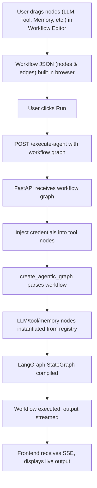
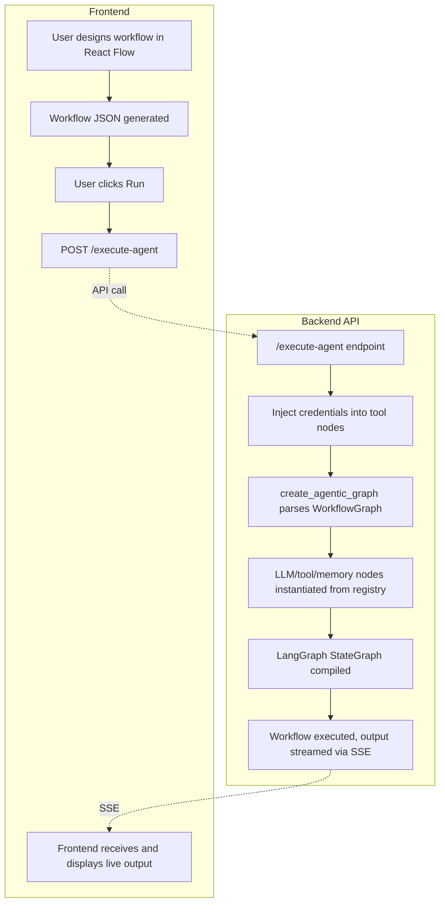

# LAWSA: No-Code Agentic Automation Platform

## Overview
LAWSA is a dynamic, no-code automation platform inspired by n8n, enabling users to visually design, configure, and execute complex agentic workflows. The system leverages LangGraph and LangChain to construct and run agentic systems, supporting integration with multiple LLM providers, tools, and secure credential management.

---

## Key Features
- Visual Workflow Editor (drag-and-drop, React Flow)
- Dynamic Agentic Backend (LangGraph/LangChain)
- Secure Credential Management (Fernet encryption)
- Multi-Provider LLM Support (OpenAI, Groq, Anthropic, etc.)
- Tool and Memory Integration as nodes
- Real-Time Streaming (SSE)
- Robust Validation & Error Handling
- JWT Authentication & Authorization
- Dynamic MongoDB Connection
- Production-Ready Security (CORS, secrets management)

---

## System Architecture



---

## Backend Flow (API to Execution)



---

## Setup

### 1. Clone the repository
```sh
git clone https://github.com/LAWSA07/LAWSA-Automation.git
cd n8n_minimal
```

### 2. Install dependencies
```sh
pip install -r requirements.txt
```

### 3. Environment variables
Create a `.env` file in `n8n_minimal/` with your API keys and secrets:
```
SECRET_KEY=your-fernet-key
GROQ_API_KEY=your-groq-key
OPENAI_API_KEY=your-openai-key
ANTHROPIC_API_KEY=your-anthropic-key
TAVILY_API_KEY=your-tavily-key
MONGODB_URI=your-mongodb-uri
```

### 4. Run the backend
```sh
uvicorn src.main:app --reload
```

---

## API Endpoints (Backend)
- `/execute-agent`: POST a workflow graph and input, receive streamed agent output (SSE)
- `/health`: Health check
- `/auth/register`, `/auth/login`: JWT authentication
- `/workflows/`, `/executions/`, `/credentials/`: CRUD for workflows, executions, credentials (JWT required)

---

## Example Workflow (with Branching)
```json
{
  "nodes": [
    {"id": "1", "type": "ManualTriggerNode", "config": {}},
    {"id": "2", "type": "CodeNode", "config": {"code": "result = {'value': 1}"}},
    {"id": "3", "type": "CodeNode", "config": {"code": "result = {'msg': 'Branch A'}"}},
    {"id": "4", "type": "CodeNode", "config": {"code": "result = {'msg': 'Branch B'}"}}
  ],
  "connections": [
    {"source": "1", "target": "2"},
    {"source": "2", "target": "3", "conditions": {"field": "json.value", "equals": 1}},
    {"source": "2", "target": "4", "conditions": {"field": "json.value", "equals": 2}}
  ]
}
```

---

## Extending the Platform
- Add new tools/LLMs in `src/agent/components.py`
- Add new node types in frontend and backend schema

---

## License
MIT 